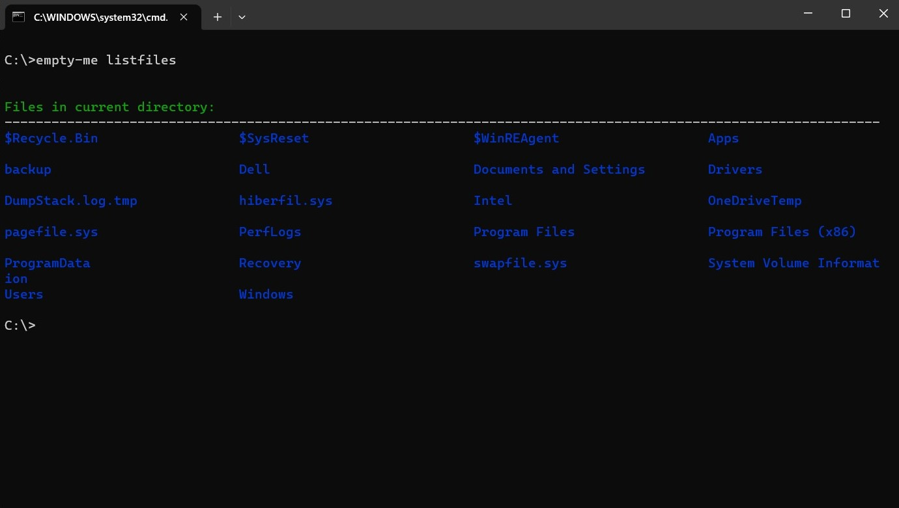
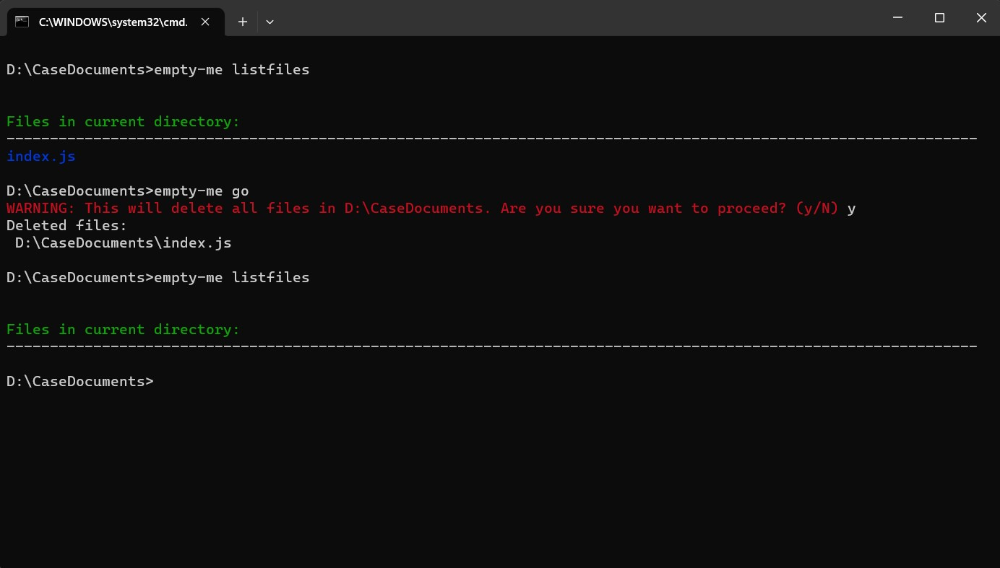

# EMPTY-CLI
It is a node cli that displays or deletes every file in in a folder.
## npm Package

This package is been added to the npm registry.
 - [NPM Registry](https://www.npmjs.com/package/empty-me)


## Installation
Before installing the CLI the system must node(16+) version and npm installed.

To install the package in your system run the following command.

```bash
npm i -g empty-me
```


## Example
To test the CLI in your system run the following command

```bash
empty-me -V
```
You can know more about the CLI by running the following command.

`empty-me` or `empty-me --help` or `empty-me help`

## Features

The basic features in this CLI is to list and remove all files and folders from the current directory.

- ### List Files
    to list files of the current directory, run the following command
```bash
    empty-me listfiles
```



- Format the folder
    to Format all files of the current directory, run the following command
```bash
    empty-me go
```



## 🚀 Author

- [@donbasilpeter](https://www.github.com/donbasilpeter)

